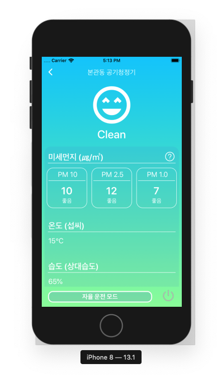
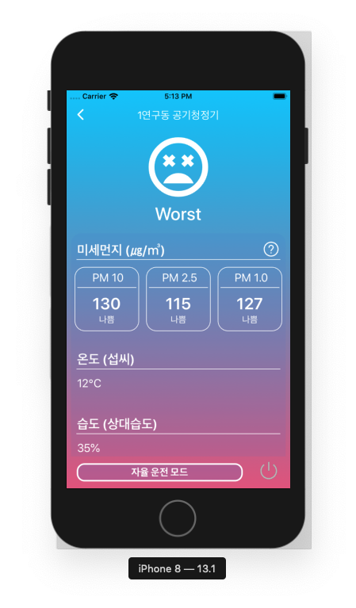

# Apuri_Project
Development of High-Performance IoT Air Purifier

## Process State
+ 저소음 공기 배출구 디자인 및 시제품 제작
+ 샤오미 miair 필터장착을 위한 프레임 디자인 및 시제품 제작
+ Arduino MCU를 활용한 동작 제어시스템 구현
+ 공기청정기 동작 상태 모니터링을 위한 OLED 디스플레이 UI 구현
+ Fan제어를 위한 릴레이 회로 구현

## Parts-List
[MCU Board]
+ arduino uno r3
[Control System]
+ 5v Relay module (1channel, 250ACV 10A))
[Display System]
+ 0.96" inch IIC/I2C Communication 12864 OLED LCD Module 4pin
[Power Supply]
+ DC12V / 2A (5.5-2.1)[P8240]

## iOS Air-purifier Manager APP

## AntiNoiseAirOutlet

### Rendering Image

### 3dPrinted AirOutlet

